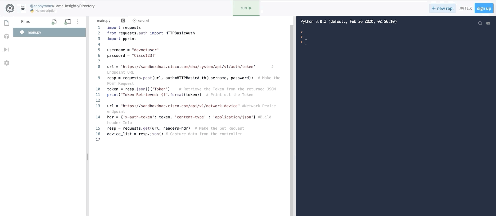

# Coding Experience (Taster Session) - Building a Full Stack Application in 2 Hours

**Lesson Duration: 60 + 60 minutes**

### Understand what programming is

What would you use the word 'program' in an everyday English? (let people give you answers)
Definitely a TV program (aka. schedule) is a great example:
- list of things that happen one after another ("Pokemon episode #312", "Eastenders episode #1004", etc)
- read from top to bottom, always happening in that order, nothing is skipped
- their value of lines in TV program is not in the name and the time slot. The value is what happens when that line is 'aired' or 'run' or 'executed'. That's when you actually go and watch your show

### Written code, Executed code

Today we will write our first computer programs. We will instruct the computer to do things from top to bottom and watch the computer execute each command. Just like when composing the TV program, we will write a set of commands (think of them as orders, requests or tasks) and then we will tell computer to interpret these lines of code as an actual actions.


### Know what computers are good at

Throughout this lessons we will give computers tasks that computers are good at (eg. repeating things, remembering a lot of data) while avoiding tasks that computers are bad at (eg. creativity).

## Coding Part 1

## **Following Simple commands**


>  LEARNING GOALS:
>	- How to print (display) things to a screen (**print**)
>	- What are strings (basically they are words)(**"a string"**)
>	- assign values **=**

Say something simple. (print, stands for print a string of characters on screen)
Notice that the word "print" is not printed on the screen. This is INTERPRETED!

```python
print('Hello World!')
```

We make computer do some work and then print the result. Notice that computer interprets things from right to left.

```python
print('Hello' + ' World!')
```

But as we said computers are easy to baffle, so it won't know what to do sometimes. Still it will try to communicate in their own clumsy way. Below will give us an error. But don't panic.

```python
print('Hello' + ' World!' + 2 + 2)
```

TypeError: can only concatenate str (not "int") to str
Oh dear, yes, let's fix it

```python
print(2 + 2)
```

Ok, rewind back to:

```python
print('Hello' + ' World!')
```


## **Remembering things**

>  LEARNING GOALS:
>	- Values can be stored in variables (assignment operator **=** )
>	- How to use variables in strings (**"#{variable}"**)

```python
greeting = 'Hello' + ' World!'
print(greeting)
```

Let's write a small theater play!

```python
print("Rebecca: Hi, I'm Rebecca!")
print("James: Hi Rebecca, I'm James!")
print("Rebecca: Good to meet you James!")
```

This does not feel DRY (Don't Repeat Yourself). Names are repeated a lot. We could extract them to two variables, you have seen this already:

```python
person1 = "Rebecca"
person2 = "James"

print("Rebecca: Hi, I'm Rebecca!")
print("James: Hi Rebecca, I'm James!")
print("Rebecca: Good to meet you James!")

```

and now we can replace all occurrences of these names in our code:

```python
person1 = "Rebecca"
person2 = "James"

print("person1: Hi, I'm person1!")
print("person2: Hi person1, I'm person2!")
print("person1: Good to meet you person2!")

```

But this still does not work! Correct. Notice that things in brackets are in English (not Python) so do not get intepreted. We need to tell Python that when we say person1 we actually mean the VALUE stored in the variable person1 (which is Rebecca). We do this with 'comicbook swearing' syntax, aka. string interpolation.

```python
person1 = "Rebecca"
person2 = "James"

print(f"{person1}: Hi, I'm {person1}!")
print(f"{person2}: Hi {person1}, I'm {person2}!")
print(f"{person1}: Good to meet you {person2}!")
```

## **Logic**

>  LEARNING GOALS:
>	- How to make decisions based on simple logic (**if else**)
>	- directing code into side track (like a train) and returning to the main track (**end**)
>	- wait for user input (**input**)
>	- use user input to change code path (**input + if**)

Let's make our computer take some decisions!

```python
person1 = "Rebecca"
person2 = "James"

print(f"{person1}: Hi, I'm {person1}!")
print(f"{person2}: Hi {person1}, I'm {person2}!")
if person1 == person2:
    print("Oh! our names are the same")
print(f"{person1}: Good to meet you {person2}!")
```

Run the code as is and then change both names to the same one and see what happens.
After every change, we want to run our code - for the time being, this will be our testing, however in real life we would write tests that can automate this process for us!


```python
person1 = "Rebecca"
person2 = "James"

print(f"{person1}: Hi, I'm {person1}!")
print(f"{person2}: Hi {person1}, I'm {person2}!")
if person1 == person2:
    print("Oh! our names are the same")
else:
    print("Oh! We have different names")
print(f"{person1}: Good to meet you {person2}!")
```


This whole value changing business is becoming cumbersome. Games would not be fun if all questions and answers were decided by the programmer when they write the code. Let's give some decisive powers to the USER, so in the part of the screen where we are RUNNING the code.

We want and then take some input from users. we'll use input. It gets a string from the screen, rather than print'ing it there.

```python

person1 = "Rebecca"
person2 = input("What's your name? ")

print(f"{person1}: Hi, I'm {person1}!")
print(f"{person2}: Hi {person1}, I'm {person2}!")
if person1 == person2:
    print("Oh! our names are the same")
else:
    print("Oh! We have different names")
print(f"{person1}: Good to meet you {person2}!")
```

play the game a few times. Make sure you reach each possible line of code

## OPTIONAL BREAK

## **Repeating things**

>  LEARNING GOALS:
>	- store and print many variables
>	- understand importance of good naming conventions and code readability
>	- store similar variables in an **list**(array)
>	- loop through the variables (**for x in xs**) and 'temporary' variables
>	- understand performance implications of improving your code (**2n vs n+1 vs 4 lines of code**)

Let's store some planet information. We'll need a new file, let's call it planets.py.

In that new file, create a variable called planet and put in it  string 'Mercury'. Then print it on the screen. You know how to do it!
Students run the file. Make sure they run the correct file.

```python
planet1 = "Mercury"
print(planet1)
```

Students: Now let's store more than one planet. Create two more variables, call them planet1, planet2, etc. Print them all to the screen.

```python
planet1 = "Mercury"
planet2 = "Venus"
planet3 = "Earth"

print(planet1)
print(planet2)
print(planet3)
```

Note that this is all great but if we have 100 planets how many lines of code will we have? (200, as in 100*2)
But computers are great at storing data. So let's use them for that. We can use something called List, it's a box in which we hold lots of data. It even uses box-looking brackets to do that! (language metaphor: "List of options")

To get things out of a list, you use the INDEX of each item. Think of your index finger - it's for pointing at things - Index in array is a number that points at each item.

```python
planets = [ "Mercury", "Venus", "Earth" ]

print(planets[1])
print(planets[2])
print(planets[3])
```

Oh dear, something is not right. Yes, that's because computers count from 0, not from 1 like humans do. So really we want to say this:

```python
planets = [ "Mercury", "Venus", "Earth" ]

print(planets[0])
print(planets[1])
print(planets[2])
```

Notice that now for 100 planets we would only need 101 lines of code! So we need n + 1. That's a dramatic improvement but still a lot of typing! Let's make this even better.

We can LOOP through the array. That means we can perform some action on each item of it! Notice loop has two elements:

- What are we looping through and how shall we call each element when it's their time `for planet in planets .... end`
- What is the action that should be performed on each loop `print(planet)`

you can think of planet as a temporary variable, that will only exist in the realm of this loop block (train track, in our metaphor). We need to give it a name, so that we can do things to it. You can use a methaphor of teaching a child to read each card in a deck (we'll use that methaphor later again). You would say: "Go through all cards in a deck, one CARD at a time, and each time read THAT CARD".

```python
planets = [ "Mercury", "Venus", "Earth" ]

for planet in planets:
    print(planet)

```

Notice that now how many lines do we need for 100 planets? just 4. How about for a million planets? Also 4. This is very efficient, because we used computer for something they are really good at!

## Ask about a short break here if needed

## **Combining many moving parts**

>  LEARNING GOALS:
>	- combine all your coding knowledge together into a game (**if in a loop**)
>	- experience your first bug (**else in a loop**)
>	- know where the concept of "debugging" comes from
>	- tackle solving a bug by reasoning (how would you explain it to an 8 year old)
>	- know the concept of a boolean flag (**a true/false variable**)
>	- extract user output out of the logic as an example of good coding practice and separation of responsibility
>	- understand that we have build a full stack app (data, input, logic, controller, output)

In the last section we will not learn anything new, but we'll combine all the knowledge we have to create a full stack game.

Add a few more planets. Then ask user what's their favourite planet. Capture their response in a variable guess and repeat it to them. Then say goodbye.

```python
planets = [ "Mercury", "Venus", "Earth", "Mars" , "Jupiter"]

favourite = input("What's your favourite planet? ")

print(f"You said: {favourite}, thank you")

for planet in planets:
    print(planet)


print("Goodbye!")
```

When we're looping through planets, it's not very useful to just print them all, let's do something else instead.

Print to the screen a message based on whether the favourite planet is in the solar system, or not.
Like "Mars is in solar system" or "Mars is not in solar system".
Use if else, which you know how to use already.

```python
planets = [ "Mercury", "Venus", "Earth", "Mars" , "Jupiter"]
favourite = intput("What's your favourite planet?")
print(f"You said: {favourite}, thank you")

for planet in planets:
  if favourite == planet:
      print(f"{favourite} is in solar system!")
  else
    print(f"{favourite} ISN'T in solar system!")


print("Goodbye!")
```

this produces a bug, because a message is printed too many times, like this:

```
Mars
You said: Mars, thank you
Mars ISN'T in solar system!
Mars ISN'T in solar system!
Mars ISN'T in solar system!
Mars is in solar system!
Mars ISN'T in solar system!
Goodbye!
```

Fun fact: Unexpected behaviour in a computer program is called a computer Bug, notably because Grace Hopper described a month that got stuck in the insides of their computer and caused it to malfunction. (for interested: It was in the relay, which is sort of like a light switch or a piano key).

## Final part: Full Stack and architecture

> **Depending on time left and on how tired the group is: here likely you will just ask students to close their laptops and watch you code the last part**

>  LEARNING GOALS:
>	- know the concept of a boolean flag (**a true/false variable**)
>	- extract user output out of the logic as an example of good coding practice and separation of responsibility
>	- understand that we have build a full stack app (data, input, logic, controller, output)

We already know that computers can store a piece of information in a little bucket, called variable. We can store strings, numbers or even arrays. But another thing we can store, and something that computers love is a true/false value (it's basically 0 or 1). We call them Boolean values, from the name of George Boole who popularised the idea.  

- Add a did_i_find_it variable and explain why it would start as a false.
- Cut out the if/else where we print if the planet was found or not
- Then explain how loop through planets can change did_i_find_it to true whenever the planet was found
- finally paste the if/else back, at the end, and change the condition that triggers it to did_i_find_it == true

```python
planets = [ "Mercury", "Venus", "Earth", "Mars" , "Jupiter"]

favourite = input("What's your favourite planet? ")

print(f"You said: {favourite}, thank you")

did_i_find_it = False

for planet in planets:
    if favourite == planet:
        did_i_find_it = True

if did_i_find_it == True:
    print(f"Yay! {favourite} is in Solar System")
else:
    print(f"Sorry, {favourite} is not In Solar System")

print("Goodbye!")
```

Have students play the game a few times.

### Full-stack app and what is software architecture

**Full Stack** means that you are building everything needed for a successful app. If app was a restaurant, full stack consists of the Front-End and Back-End. Back-end is the kitchen, hobs, ingredients, cooks, the printer through which the orders come in and the window through which the food comes out - everything that the user does not see. Front end will be the chairs, tables, waiters, printed menus, sigh over the entrance - everything that the user does see.

**Front-End** is what user sees and interacts with:

- View (prints) this is things that the user interacts with, what they see and click and type. Notice that right now this is text on the screen, but might just as well be voice on amazon echo, pretty buttons on a website or physical lamp in a spaceship

**Back-End** is everything that the user does not see, but is happening behind the scenes:

- Data storage (planets) which can be written in code (like we did it), or read from a file, or from a database. Notice that if we changed how planets data get in to the array, the rest of the app will still work smoothly.
- Model (boolean flag, for loop and the 'if' inside it) - this is where we extract all the knowledge and decision making of our program. Notice that there might be some improvements we do do the way we search and communicate our findings, but the rest of the app should still work the same if we adjust it.
- Controller (selecting what View to show based on the data). This is the part that connects all the other parts. It can also be swapped, or improved, without impacting on the rest of the system. You can think of how the Amazon website looks different depending on if you are logged in or not. There's probably a boolean flag is_user_logged_in (true or false) in their code. Based on its value Amazon might show you the Log In button or Log Out button.

This was a simplified example of Full Stack MVC+D model, but hopefully you see the modular architecture of code that makes it convenient to work on and error-proof.


# Working with external systems - REST API's

For this exercise we're going to apply some of the Python we've learnt and take it a step further by interacting with other systems by using their REST API. Within this exercise we're going to be working with the REST API for DNA-Centre. REST API's allow us to interact with another system send and recieve data, we can typically use them to automate a repetitive task for this example going to create a script that logs into a DNA Centre and collects information about the network devices on that DNA-Centre. 

## Pre-requisites

First in your script we need to configure some libraries we'll need. The main module we'll use in this exercise is the reponse module, which allows us to make HTTP requests and work with the response. We'll walk you through how it works in later steps, for now just import the libraries we need with the below commands.

```
import requests
from requests.auth import HTTPBasicAuth
import pprint
```


## Authentication

As we would do with any system we have to authenticate before we can use it. This is pretty much as we would do on the web, by providing a username and password. We'll use the below code example to get a token back and save the token in a variable called token to use later.

```
username = "devnetuser"
password = "Cisco123!"

url = 'https://sandboxdnac.cisco.com/dna/system/api/v1/auth/token'       # Endpoint URL
resp = requests.post(url, auth=HTTPBasicAuth(username, password))  # Make the POST Request
token = resp.json()['Token']    # Retrieve the Token from the returned JSON
print("Token Retrieved: {}".format(token))  # Print out the Token
```


When the code above runs, under the hood all that's happening is a API call is being sent with our username and password  and a token is being returned which we can use now in further API requests (Don't worry, as you can see it's running over HTTPS so all messages are encrypted. This is almsot exactly what happens when you login to DNA-C in the webui, your browser will store a cookie. It's the same concept.

## Getting a list of devices

Now we've logged in and our token is stored in a variable (called Token) it's time now to build our script. Here we're going to use the network device API to get

```
url = "https://sandboxdnac.cisco.com/api/v1/network-device" #Network Device endpoint
hdr = {'x-auth-token': token, 'content-type' : 'application/json'} #Build header Info
resp = requests.get(url, headers=hdr)  # Make the Get Request
device_list = resp.json() # Capture data from the controller

```




Now we've go our response, it's time to print it out to the console so the user can reader it. In an actual app we might build a report or use the response to take another action in our program however we'll leave that for another time. 

For now lets just keep it simple and print out our output to the console. To do that we could just simply use the ```print(device_list)``` and we've done in the past but this just prints out a big block of text which isn't really readable. However another way is to use a module called pprint (pretty print) to prin the json response out in a nice formatted way which is much easier to read.

```
pp = pprint.PrettyPrinter(indent=4)# Pretty print the data
pp.pprint(device_list)
```


Congratulations, you've just made your first API call!

